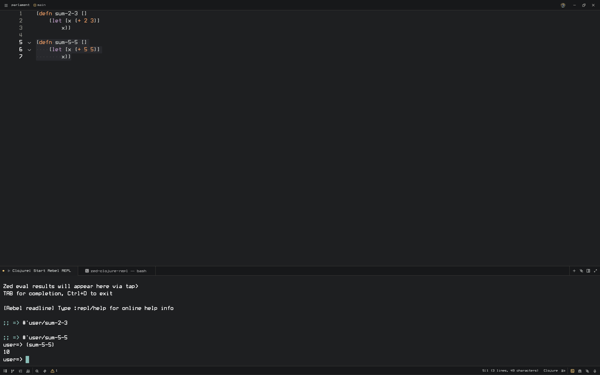

# Zed Clojure REPL

> ⚠️ **Early Draft** — This is an experimental setup. May require adjustments for your system. Tested on Linux only; macOS is untested.

Clojure/ClojureScript development environment for Zed editor using [rebel-readline](https://github.com/bhauman/rebel-readline) and [Portal](https://github.com/djblue/portal).



## How It Works

1. **Start REPL** (`Ctrl+C Ctrl+R`) — launches rebel-readline with embedded nREPL server
2. **Eval code** (`Ctrl+X Ctrl+E`) — sends selected code to nREPL
3. **See results in REPL** — eval results appear in REPL via `tap>`, no separate windows

All eval commands share the same nREPL session. The `.nrepl-port` file is created automatically.

## Features

- **Auto-start nREPL** — REPL starts embedded nREPL if none running
- **Results in REPL** — eval results appear in REPL via tap>
- **Rich REPL** — [rebel-readline](https://github.com/bhauman/rebel-readline) with TAB completion, syntax highlighting, history
- **ClojureScript** — shadow-cljs support (parallel to Clojure REPL)

## Requirements

- [Zed editor](https://zed.dev)
- [Clojure CLI](https://clojure.org/guides/install_clojure)
- `nc` (netcat) — for port checking

## Installation

```bash
git clone https://github.com/psychedel/zed-clojure-repl.git
cd zed-clojure-repl
./install.sh
```

Restart Zed after installation.

## Quick Start

1. Open any `.clj` file in Zed
2. Press `Ctrl+C Ctrl+R` — starts REPL with nREPL
3. Select code, press `Ctrl+X Ctrl+E` — result appears in REPL

## Keyboard Shortcuts

| Shortcut | Action |
|----------|--------|
| `Ctrl+C Ctrl+R` | Start Clojure REPL |
| `Ctrl+C Ctrl+B` | Start shadow-cljs watch |
| `Ctrl+C Ctrl+L` | Connect to ClojureScript REPL |
| `Ctrl+X Ctrl+E` | Eval selection |
| `Ctrl+C Ctrl+C` | Eval form at point |
| `Ctrl+C Ctrl+K` | Eval buffer |
| `Ctrl+C Ctrl+N` | Reload namespace |
| `Ctrl+C Ctrl+T` | Run tests |
| `Ctrl+C Ctrl+D` | Documentation |
| `Ctrl+C Ctrl+S` | Show source |
| `Ctrl+C Ctrl+E` | Last exception |

## ClojureScript

Start shadow-cljs separately:

```bash
npx shadow-cljs watch app
```

Use `Ctrl+C Ctrl+B` to start shadow-cljs, then `Ctrl+C Ctrl+L` to connect REPL.

## Uninstall

```bash
./uninstall.sh
```

## License

MIT
